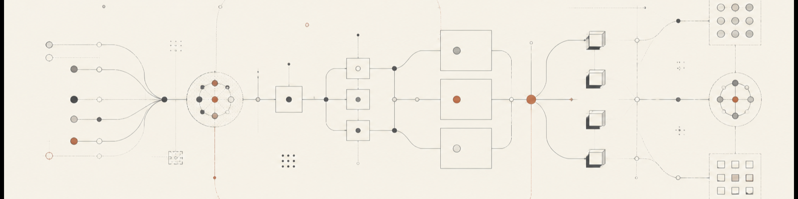

  

# Stas Shevchenko

Software Architect · Distributed Systems · Scala · Rust · Open Source

I design backend systems and the architecture around them—clear boundaries, reliable messaging, and software that remains understandable as it grows.

My work and interests sit at the intersection of distributed systems, functional Scala, Rust, developer tooling, and open-source infrastructure.

### Currently exploring

Resilient service architecture, event-driven systems, build tooling, and the places where Scala and Rust make complex infrastructure easier to reason about.
